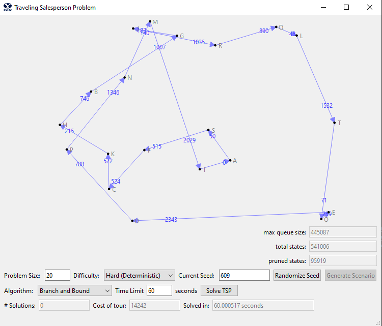
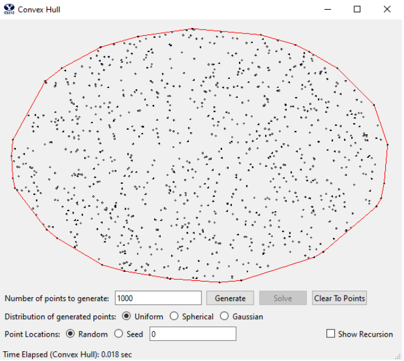
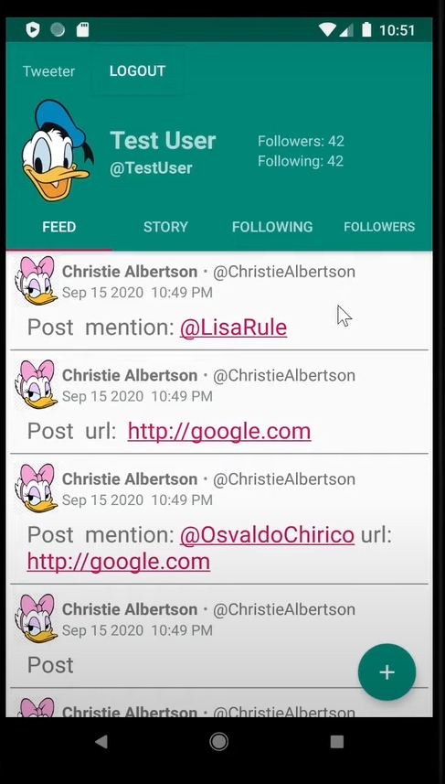
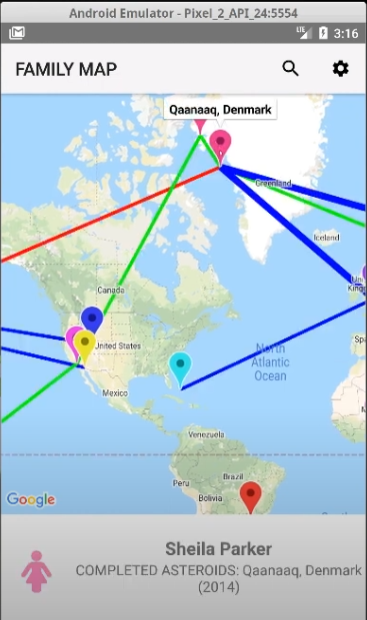

# Hi there 👋
**`Tinkerer(Software developer/Raspberry Pi enthusiast/problem solver)`**
I'm a student at BYU studying computer science while also creating gadets and learning more about hardware. 

### 🧰 Languages and Tools 

### 📰 Recent Projects 

                                                 
<!--
**tpurba/tpurba** is a ✨ _special_ ✨ repository because its `README.md` (this file) appears on your GitHub profile.

Here are some ideas to get you started:

- 🔭 I’m currently working on ...
- 🌱 I’m currently learning ...
- 👯 I’m looking to collaborate on ...
- 🤔 I’m looking for help with ...
- 💬 Ask me about ...
- 📫 How to reach me: ...
- 😄 Pronouns: ...
- ⚡ Fun fact: ...
-->
