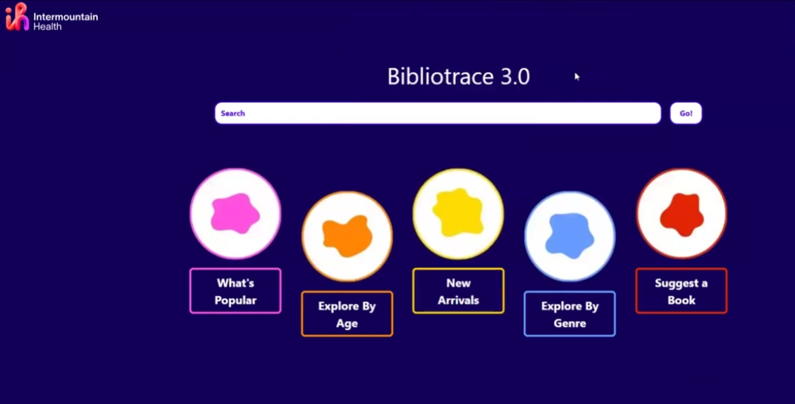
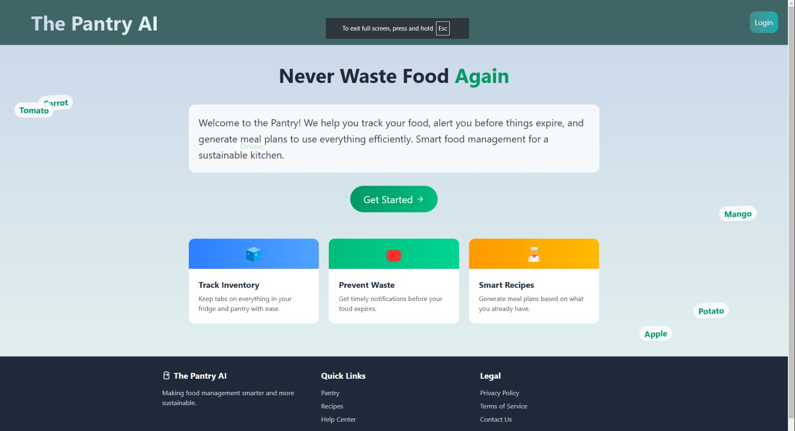
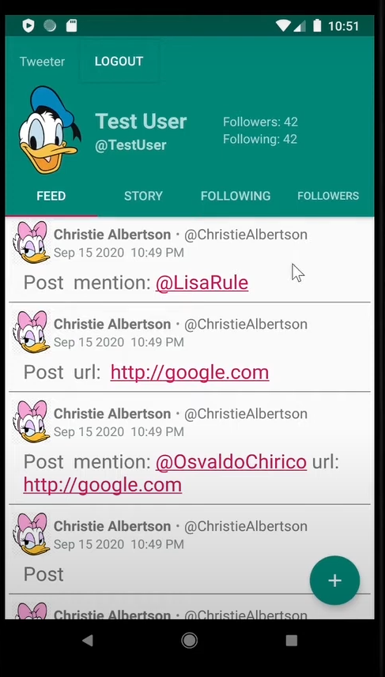
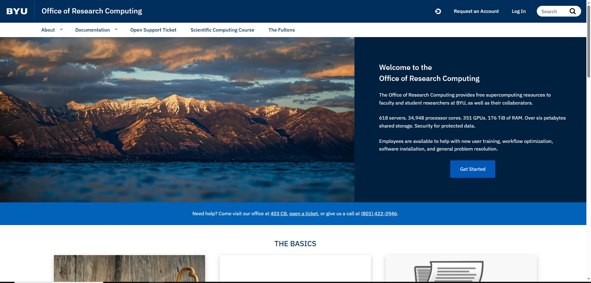
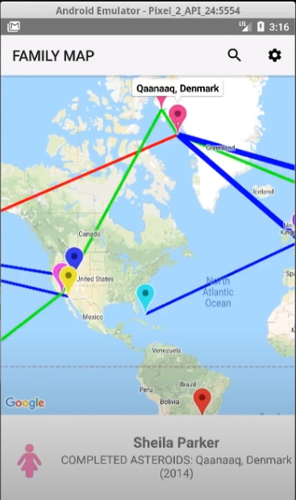

# Hi there 👋  
**Software Engineer | Full Stack Developer | Salesforce Engineer**

I’m a Software Engineer focused on building scalable full-stack systems, Salesforce solutions, and data-driven web applications. I enjoy turning complex business problems into efficient, production-ready software used by real users.

---

## 💼 Experience

### Full Stack Developer — OpenRoad Global (2025–Present)
- Built Salesforce-based **carrier scoring system (LWC + Apex)** improving carrier selection efficiency with sub-3s load times  
- Developed **automation system for 11,000+ emails**, achieving 1,200+ responses (5–10% response rate)  
- Engineered **bulk email + queue-based processing system** used by 17+ reps  
- Built **shipment tracking platform (Python + React + Azure)** with 3,000+ requests  
- Created **lead ingestion pipeline** generating 5,000+ leads in 2 months with <5s processing  

### Software Engineer Intern — Church of Jesus Christ of Latter-day Saints (2025)
- Built student evaluation system for BYU Pathways (1,500+ users supported)  
- Worked with Sitefinity, JavaScript, HTML/CSS, and workflow automation  
- Led product demos and improved documentation processes  

### Full Stack Developer — BYU Office of Research & Computing (2024–Present)
- Developed storage analytics system serving 6,000+ users  
- Improved search performance by 50% via backend optimization  
- Built authentication, password recovery, and compliance training systems  
- Designed protected data training system based on user roles  

---

## 🧰 Tech Stack

**Languages:** Python, Java, JavaScript, TypeScript, C++, C#, SQL  
**Frontend:** React, HTML, CSS, LWC  
**Backend:** Node.js, Flask, Apex, Uvicorn  
**Cloud:** AWS, Azure  
**Databases:** MySQL, PostgreSQL, SQL Server, MongoDB, Redis  
**Salesforce:** Apex, LWC, SOQL, Flows, APIs  
**Tools:** Git, Docker, Android Studio, Unity  

---

## 🎓 Education

**Brigham Young University** — B.S. Computer Science (GPA: 3.61)  
- BYU Leadership Scholarship  
- MSS Scholarship  
- 3rd Place Capstone Project  

---

## 🚀 Projects Gallery

<table>
	<tr>
		<td align="center">
			 
			<b>Biblio-trace 3.0</b> 
			Full-stack library system (React, MySQL, JWT, data migration tools)
		</td>
		<td align="center">
			 
			<b>Pantry-AI</b> 
			AI-powered food tracking + recipe generator (Hackathon, Top 83%)
		</td>
		<td align="center">
			 
			<b>Tweeter App</b> 
			Scalable Android social app handling 10,000+ posts
		</td>
	</tr>
	<tr>
		<td align="center">
			 
			<b>BYU Office of Research & Computing</b> 
			Storage analytics, search optimization, authentication systems
		</td>
		<td align="center">
			 
			<b>Family Map App</b> 
			(Project details to be added)
		</td>
		<td align="center">
			 
			<b>Tradeoff</b> 
			(Project details to be added)
		</td>
	</tr>
</table>

---

## 📌 Focus Areas
- Full-stack web systems  
- Salesforce engineering & automation  
- Scalable backend architecture  
- AI-integrated applications  
- Data pipelines & system optimization  
